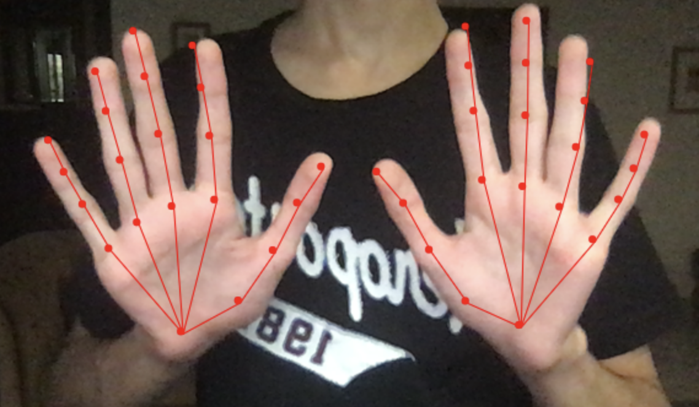

# Hand Keypoint Detection in the Browser

This application detects hands in a live video stream.

<p align="center">
    
</p>

It was created by integrating two open-source tools:

* [Handtrack.js by Victor Dibia](https://victordibia.github.io/handtrack.js/) - This neural network is used to detect bounding boxes around the hands seen in a video frame.
* [MediaPipe HandPose](https://github.com/tensorflow/tfjs-models/tree/master/handpose) - This machine learning model is used to detect 21 3D keypoints of each detected hand.

This application was created to overcome the limitations presented by both the models: Handtrack.js only detects bounding boxes around hands and does not predict finger joints and palm keypoints, whereas HandPose is only able to detect keypoints in a single hand at a time. This application combines Handtrack.js and HandPose to detect the keypoints of multiple hands in a single video frame. The model first applies Handtrack.js to predict the bounding boxes around each detected hand. These bounding boxes are then individually fed to the HandPose model, which detects whether a hand is actually present within the bounding box and, if so, predicts the finger joints and palm keypoints.

The HandTrack.js model often produces bounding boxes that are too tight for the HandPose model to be able to detect a hand within them. Therefore, by default, I scale the bounding boxes by a factor of 2. I have also provided the option to scale the width and height of the bounding boxes according to the user’s preference. Other variables can also be changed, including:
* Score Threshold - This determines what the minimum bounding box confidence score should be.
* Maximum number of boxes - This specifies the maximum number of boxes that the HandTrack.js model should detect.
* IoU Threshold - This clusters the bounding boxes by spatial closeness measured with IoU and keeps only the most confident bounding box among each cluster.

### Running the application

To run locally, navigate to the root directory and run:

```python app.py```

Then, open a browser and type in the URL ```http://127.0.0.1:5000/```.
